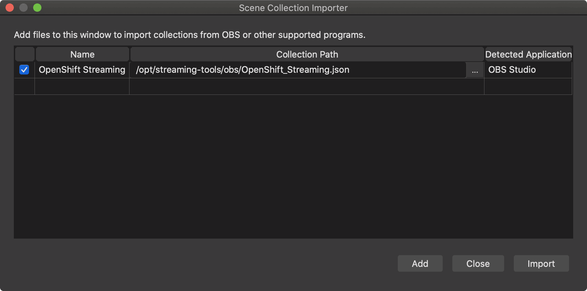

# OBS Assets

This directory houses assets needed for streaming when using [**OBS**](https://obsproject.com/). For guides and helpful tips and tricks, please refer to the [documentation](https://github.com/cloud-platforms-streaming/docs).

## HOWTO install assets so they "just work"

Since OBS is a first class citizen on Windows, the decision has been made to [use Windows VM in Azure](https://github.com/cloud-platforms-streaming/azure-obs-vm) to produce livestreams with OBS. This is handled automatically in the azure-obs-vm creation process but, if you want to use the assets on an existing system, you need to install them manually.

1. Clone this repo directly to `C:\`
1. In OBS remove any existing **OpenShift Streaming** Scenes from the Scene Collection menu  
(NOTE: you won't do this the first time. Also, if you don't do this OBS will probably crash. Sadly, OBS doesn't automatically pick up Scene changes)
1. In OBS, select Scene Collection -> Import, use the path to the OBS scenes `C:\streaming-tools\obs\openshift_streaming\basic\scenes`\, select them all, and click Add.

## What's in the Scene

TODO: Describe Scene and HOWTO use it effectively; sound settings are going to be tough

### Breaks, in stream commercials, etc.

Breaks are often a thing in longer lives streams. The a psychological theory that 50 minutes of instruction followed by a ten minute break is a solid way to provide instruction in immersive environments. Twitch is not a fully immersive environment, but breaks are often expected during longer Twitch streams

There is a "[Be Right Back](obs/assets/OpenShift_Twitch_BRB.mp4)" animation for use here if you want to take a break, change the OBS scene to Break.